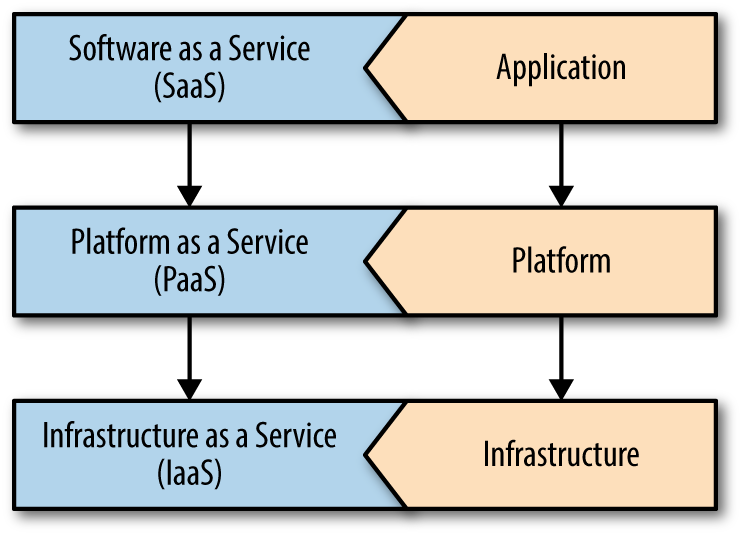

# Chapter 1 

## Terms
* Platform
	* a tool that automates a set of repeatable practices
	* a set of capabilities that help us to either build or run applications.
	* summarized by the nature in which they impose constraints on how developers build applications.
	* Can automate tasks that are not essential to supporting the business requirements of an application

* Dependency injection
	* the ability to build component code that is agnostic to creation and origin of a dependency.
	* Component code that is dependent on base-types and interfaces, not coupled to a particular implementation.

## The Three-Tier Model of Cloud Computing

* from Cloud Native Java, Chapter 1

### Software As a Service (SaaS)
* is a software licensing and delivery model in which software is licensed on a subscription basis and is centrally hosted.

### Platform as a Service (PaaS)
* provides computing platforms which typically includes
	* operating system
	* programming language execution environment
	* database
	* web server
* Examples:
	* AWS Elastic Beanstalk
	* Windows Azure
	* Heroku
	* Force.com
	* Google App Engine
	* Apache Stratos

### Infrastructure As a Service (IaaS)

* Cloud Native
	* a mindset that admits to not being able to reliably predict when and where capacity will be needed.

	
	
	
	
## The Twelve Factors
* set of application development principles compiled by the creators of Heroku.
* The Twelve-Factor App is a website that describes SaaS applications designed to take advantage of the common practices of modern cloud platforms.

### Value of building application following 12 Factor Methodology
* **Core Ideas**
	* Use declarative formats for setup automation
		* to minimize time and cost for new developers joining project
	* Have a clean contract with the underlying operating system
		* offering maximum portability between execution environments
	* Are suitable for deployment on modern cloud platforms
		* obviating the need for servers and systems administration
	* Minimize divergence between development and production
		* enabling continuous deployment for maximum agility
	* And can scale up without significant changes to tooling, architecture, or development practices
* **Code Practice**
	* Codebase
		* One codebase tracked in revision control, many deploys
	* Dependencies
		* Explicitly declare and isolate dependencies
	* Config
		* Store config in the environment
	* Backing services
		* Treat backing services as attached resources
	* Build, release, run
		* Strictly separate build and run stages
	* Processes			
		* Execute the app as one or more stateless processes
	* Port binding
		* Export services via port binding
	* Concurrency
		* Scale out via the process model
	* Disposability
		* Maximize robustness with fast startup and graceful shutdown
	* Dev/prod parity
		* Keep development, staging, and production as similar as possible
	* Logs
		* Treat logs as event streams
	* Admin processes
		* Run admin/management tasks as one-off processes

## 4 Main Pillars of Cloud Native System
* Observability
* Agile - easy to iterate upon and change
* 